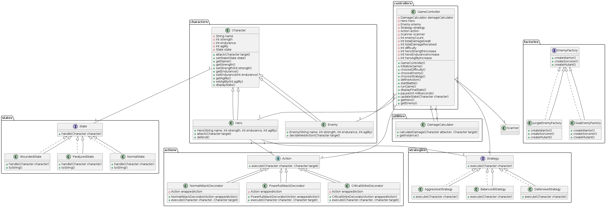

# Console RPG Game

This project is a console-based RPG game where the protagonist fights against enemies using different weapons, types of attacks, and strategies. The game is played in turns and continues until the player loses. The player accumulates points with each battle won.

## Features

- Turn-based combat system
- Different types of enemies and strategies
- State pattern to manage character states
- Decorator pattern to handle character actions
- Abstract factory pattern for creating different enemies
- Singleton pattern for damage calculation
- Facade pattern for game controller
- Difficulty levels: Easy, Medium, Hard

## Class Diagram



## Getting Started

### Prerequisites

- Java Development Kit (JDK) 8 or higher

### Installation

1. Clone the repository:
    ```sh
    git clone https://github.com/zxc228/console_rpg.git
    cd console_rpg
    ```

2. Compile the project:
    ```sh
    javac -d bin src/main/Main.java src/characters/*.java src/states/*.java src/strategies/*.java src/actions/*.java src/factories/*.java src/controllers/*.java src/utilities/*.java
    ```

3. Run the game:
    ```sh
    java -cp bin src.main.Main
    ```

### Usage

When you run the game, follow the prompts to:

- Enter your hero's name.
- Choose the type and class of the enemy.
- Choose your strategy.
- Engage in turn-based combat until either the hero or the enemy is defeated.
- Choose whether to continue fighting new enemies or exit the game.
- View the final statistics of your hero after the game ends.

### Project Structure
```
src/
|-- actions/
|   |-- Action.java
|   |-- PowerfulAttackDecorator.java
    |-- NormalAttackDecorator.java
|   |-- CriticalStrikeDecorator.java
|-- characters/
|   |-- Character.java
|   |-- Hero.java
|   |-- Enemy.java
|-- controllers/
|   |-- GameController.java
|-- factories/
|   |-- EnemyFactory.java
|   |-- JungleEnemyFactory.java
|   |-- SeaEnemyFactory.java
|-- main/
|   |-- Main.java
|-- states/
|   |-- State.java
|   |-- NormalState.java
|   |-- WoundedState.java
|   |-- ParalyzedState.java
|-- strategies/
|   |-- Strategy.java
|   |-- AggressiveStrategy.java
|   |-- BalancedStrategy.java
`-- utilities/
    |-- DamageCalculator.java
```

### Class Descriptions

- **Main**: The entry point of the game.
- **GameController**: Manages the game flow, player interactions, enemy selection, and battles.
- **Character**: Abstract class for characters (hero and enemies).
- **Hero**: Class representing the hero character.
- **Enemy**: Class representing the enemy characters.
- **State**: Interface for character states.
- **NormalState, WoundedState, ParalyzedState**: Concrete states of characters.
- **Strategy**: Interface for different strategies.
- **AggressiveStrategy, BalancedStrategy**: Concrete strategies for the characters.
- **Action**: Interface for actions performed by characters.
- **PowerfulAttackDecorator, CriticalStrikeDecorator, NormalAttackDecorator**: Decorators for enhancing character actions.
- **DamageCalculator**: Singleton for calculating damage.
- **EnemyFactory**: Abstract factory for creating enemies.
- **JungleEnemyFactory, SeaEnemyFactory**: Concrete factories for creating different types of enemies.

### How the Code Works

1. **Initialization**:
   - The game starts by prompting the player to enter the hero's name and choose a difficulty level.
   - Based on the difficulty level, the initial attributes of the hero and the increments for subsequent enemies are set.

2. **Game Flow**:
   - The `GameController` manages the entire game flow. It initializes the game, manages battles, and handles user interactions.
   - The main game loop in `GameController` continues until the hero is defeated or the player chooses to exit.

3. **Combat**:
   - Each battle is managed by the `startBattle` method in `GameController`. The player chooses a strategy and an action.
   - Strategies (Aggressive, Balanced, Defensive) affect the hero's attributes during combat.
   - Actions (Normal Attack, Powerful Attack, Critical Strike) determine the type of attack the hero performs.
   - The `DamageCalculator` singleton is used to calculate the damage dealt to the enemy.

4. **Enemies**:
   - Enemies are generated using the Abstract Factory pattern. `JungleEnemyFactory` and `SeaEnemyFactory` create different types of enemies.
   - The attributes of enemies are increased based on the difficulty level and the number of enemies defeated.

5. **States**:
   - The State pattern manages the states of characters (Normal, Wounded, Paralyzed).
   - Characters transition between states based on their health.

6. **Design Patterns**:
   - **State**: Manages the state transitions of characters.
   - **Strategy**: Allows the hero to adopt different combat strategies.
   - **Decorator**: Enhances actions with additional behaviors.
   - **Abstract Factory**: Creates various types of enemies.
   - **Singleton**: Ensures a single instance of the damage calculator.
   - **Facade**: Simplifies game management through the `GameController`.
   
### Contributing

1. Fork the repository.
2. Create your feature branch (`git checkout -b feature/AmazingFeature`).
3. Commit your changes (`git commit -m 'Add some AmazingFeature'`).
4. Push to the branch (`git push origin feature/AmazingFeature`).
5. Open a pull request.

### License

This project is licensed under the MIT License. See the [LICENSE](LICENSE) file for details.

### Acknowledgements

- Inspired by classic RPG games.
- Developed as part of a programming course project.
